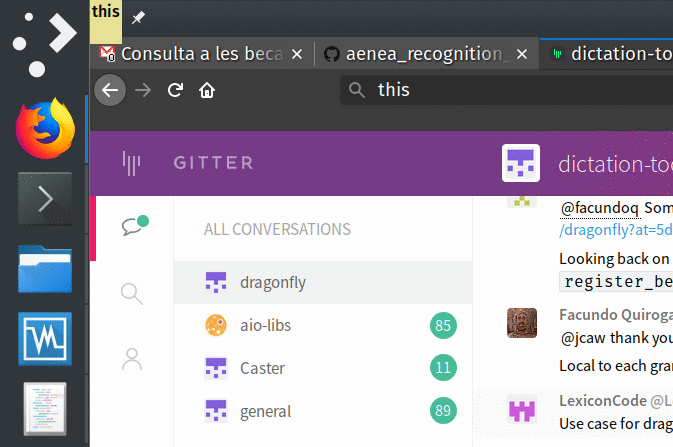

# aenea_recognition_results

A plug in for [aenea](https://github.com/dictation-toolbox/aenea) to display the results of the recognition in a similar fashion to other speech engines such as Dragon NaturallySpeaking.

## Prerequisites

This plugin has been tested with `Kubuntu 19.04`, `python 2.7.15+`, [`aenea commit 
3b1b71a`](https://github.com/dictation-toolbox/aenea/commit/3b1b71a63570a7b6c8e26c76874c48c62107a0ec),`dragonfly 0.16.0`, a `windows 7` guest VM and a `linux_x11` host. It is quite likely that the plug-in will work with other setups, since it is really simple has very few requirements.

To use the plugin, you require:
1. A working aenea/dragonfly installation. 
2. The `tkinter` widget library, for the same Python environment in which aenea is running. In Ubuntu, you can install the library with `apt install python-tk`

## How to install

1. Copy the file `dragonfly/_observer.py` to your dragonfly user folder
2. Copy the *contents* of the folder `plugins`  to the `server/linux_x11/plugins/` folder. This includes the yapsy   plug-in definition file  and   the folder with the server plug-in  module (`recognition_results`).

Note that the plugin uses a local file in the server to communicate the results to the recognition window. This file stores in plain text the results of your speech. If security or privacy of what you input is a concern, you should delete this file regularly and/or take the appropiate measures. By default, the file is `~/.aenea_phrases.log`.

##  Customization

 The `recognition_results`  folder contains the file `config.py`, which allows customization of the location of the results file storage,  and the appearance of the  recognition results window.
